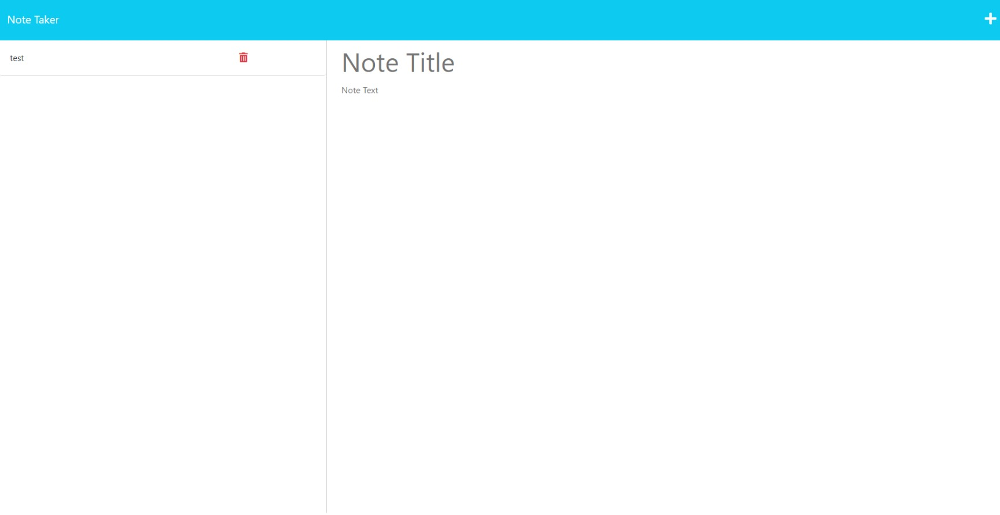

# Note-Taker-Plus

## 
  
# Table of Contents:
  
  1. [Description](#description)
  2. [Installation](#installation)
  3. [Usage](#usage)
  4. [Contributors](#contributors)
  5. [License](#license)
  6. [Screenshot](#screenshot)
  7. [Link](#link)
  8. [Tests](#tests)
  9. [Questions](#questions)
 10. [Citing Credit](#citing)
  
## Description 

    This is a tool to take notes and allow you to acces the notes saved to change them whenever you like. They are saved in a .JSON file and the file can be updated dynamically whenever you access the site where you can read, save, and delete your notes at will.

      
  
      
## Installation 

There is no installation for this application just click the link and use it for yourself.

## Usage 

  
   This will be useful for anyone who needs to write notes down and have them saved somewhere so you can access them whenever you need. This application allows you to store, update, and delete any notes you make.

      
  
## Contributors 

 ttieman
  
## License 

  ### This application is covered under the [MIT LICENSE](https://opensource.org/licenses/MIT),
  and should be referred to for any questions about legal licensure considering 
  this application. 

## ScreenShot  

## Link

To Realeased Application: [https://nameless-forest-55380.herokuapp.com/](https://nameless-forest-55380.herokuapp.com/)  

To the Repo:
[https://github.com/ttieman/note-taker-plus](https://github.com/ttieman/note-taker-plus)  
  
  
## Tests 

### The tests ran for this application were done through user experience.
  
## Questions 

  
### If you have and questions my git hub user is [ttieman](https://github.com/ttieman)
  
### My email is tiemantanner@gmail.com if you wish to reach out to me directly.

## Citing Credit

 Web3 schools was used for referencing javascript elements while building this application!

 [https://www.w3schools.com/](https://www.w3schools.com/)

 The inquirer documentation and module were used to build this application.

 [https://github.com/SBoudrias/Inquirer.js](https://github.com/SBoudrias/Inquirer.js)

 Express is used for serving all the webpages and data, and the expressjs website was used as reference to impliment this.

 [https://expressjs.com/en/guide/routing.html](https://expressjs.com/en/guide/routing.html)

 The bootsrap documentation and module were used to build this application.

 [https://getbootstrap.com/docs/4.1/getting-started/introduction/](https://getbootstrap.com/docs/4.1/getting-started/introduction/)
